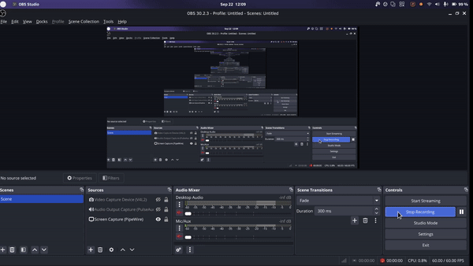
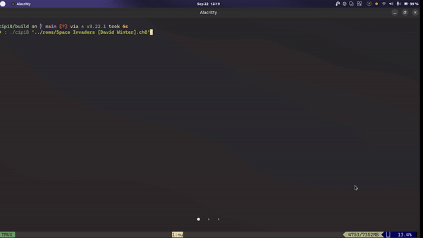
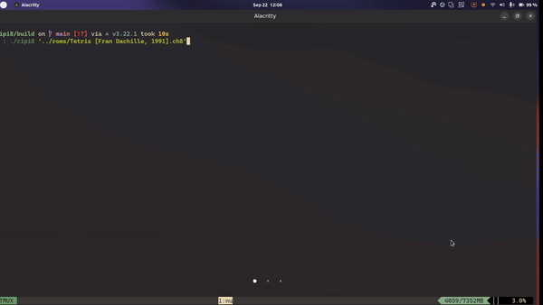

# cipi8

Cipi is a Chip8 emulator written primarily in CXX. You can read more about Chip8 [here](https://en.wikipedia.org/wiki/CHIP-8).
There are a total of 34 instructions taken from [here](http://devernay.free.fr/hacks/chip8/C8TECH10.HTM).

You can also download release binaries from the [releases page](https://github.com/prashantrahul141/cipi8/releases).




_Playing octojam1title.ch8_



_Playing Space Invaders (David Winter)_



_Playing Tetris (Fran Dachille, 1991)_


## Building

The project uses Cmake as it's prebuild system.

#### Requirements:

- A C compiler
- [Cmake](https://cmake.org/)
- [Ninja](https://ninja-build.org/)

1. Clone the repo and cd into the project root directory.

```sh
git clone https://github.com/prashantrahul141/cipi8 && cd cipi8
```

2. Run cmake to create build files for your platform.

```sh
cmake . -G Ninja
```

additionally you can provide `-DCMAKE_BUILD_TYPE={configuration}` to build in `Debug`, `Release` configurations.

3. Run Ninja to build the project

```sh
ninja
```
You can provide `-j` flag to build in parallel

```sh
ninja -j 10
```


## Using the emulator
```sh
Usage: cipi8 [--help] [--version] [--scale VAR] [--delay VAR] rom_file

Positional arguments:
  rom_file       The rom file to run. [required]

Optional arguments:
  -h, --help     shows help message and exits
  -v, --version  prints version information and exits
  --scale        Scale of the display [nargs=0..1] [default: 15]
  --delay        Delay between CPU cycles. [nargs=0..1] [default: 6]
```
There are some examples roms in the /roms directory, you can test them.
